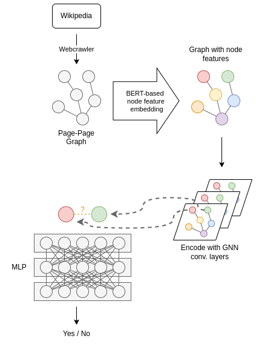
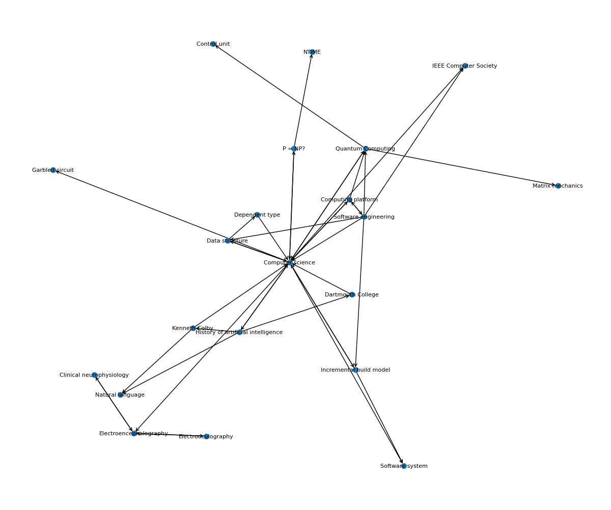

# Wiki Connect
Finding new connections between Wikipedia pages.

## Overview and Goals
**More details about the plan (assignment 1) can be found [here](PLAN.md).**
This project aims to uncover hidden connections between Wikipedia pages that are not directly linked. While Wikipedia uses contextual linking to connect related topics within descriptions, some connections remain undiscovered because the related topics are not explicitly mentioned. The goal is to use deep learning and graph-based approaches to identify these hidden relationships and enhance the netgraphwork of links between Wikipedia pages. 

The following diagram shows the general pipeline of the project:


## Setup
The easiest way to setup the project is to use `uv` and simply run the following command:
```bash
uv sync
```

This will install all necessary dependencies and setup the project for you. If you want to do this manually, you can also install the `wiki_connect` package and all dependencies with the following command:
```bash
pip install -e .
pip install -r requirements.txt
```

Tests can subsequently be run with the following command:
```bash
pytest
```

## Dataset Generation
The dataset is generated by a seeded web scraping process. Starting from a use specified seed term (e.g. "Deep Learning"), the scraper collects the content of the Wikipedia page and extracts the links to other Wikipedia pages. The scraper then recursively visits the linked pages and extracts their content and links. This process continues until a specified depth is reached. Besides the depth, the search is also limited by a customizable breadth, which limits the number of newly visited pages per layer. The extracted data is then preprocessed and stored in a graph structured format as a `.json` file or for compactness as a `.pkl` binary file.



To access the Wikipedia pages, the scraper uses the Wikimedia API. The API allows for easy access to the content of Wikipedia pages and provides a structured way to extract the links to other pages. 

The script for generating the dataset can be found in the `data` directory and is a standalone command line tool, that can be run with the following command:
```bash
python src/wiki_connect/data/crawler.py --start_title "Deep Learning" --depth 2 --layer_size 5 --output_file "data/deep_learning_graph.json"
```

## Node Embeddings
The node embeddings are generated by using a BERTEncoder to encode the content of the overview section of the Wikipedia pages. More specifically, we use the `bert-base-uncased` model from the Hugging Face Transformers library, which is pre-trained on a large corpus of text data using a masked language model objective. This means that the model has learned to predict masked words in a sentence, which allows it to capture the context of the words in the sentence. The embeddings are stored in `.pt` files and follow the format used by the PyTorch Geometric library.

The script for generating the node embeddings can be found in the `model` directory and is a standalone command line tool, that can be run with the following command (the `--output_path` argument is optional and defaults to the same path as the input graph with the extension changed to `.pt`):
```bash
python src/wiki_connect/model/embed.py --graph_path "data/deep_learning_graph.json"
```

## Link Prediction
The link prediction model consists of two parts: an encoder and a predictor. The encoder is responsible for improving node embeddings to utilize relational information from the connections of the Wikipedia pages, while the predictor is responsible for predicting the likelihood of a link between two nodes based on their embeddings. The model is trained using a binary cross-entropy loss function and the Adam optimizer.

The encoder model is implemented using a graph convolutional network (GCN) with the PyTorch Geometric library. The model consists multiple layers, each containing:
- graph convolutional layer
- ReLU activation (except for the last layer)
- dropout layer (except for the last layer)

The predictor model is implemented using a feedforward neural network with the PyTorch library. The model consists of multiple layers, each containing:
- linear layer
- ReLU activation (except for the last layer)
- dropout layer (except for the last layer)
A sigmoid activation function is used after the last layer to output a value, that we can utilize as a probability of a link between two nodes.

### Training
To ensure a fair evaluation of the model without leakage of data, the dataset is split into a training (70%), validation (15%), and test set (15%). Each set contains an equal number of positive and negative samples (i.e. links between nodes and non-links between nodes), which ensures a balanced dataset. The model is trained using the training set and the best model is selected based on the performance on the validation set. The final performance of the model is evaluated on the test set.

The script for training the link prediction model can be found in the `model` directory and is a standalone command line tool, that can be run with the following command (there are additional arguments for the hyperparameters of the model):
```bash
python src/wiki_connect/model/trainer.py --data_path data/deep_learning_graph.pt
```

### Hyperparameters
The hyperparameters of the model are optimized using a grid search approach. The hyperparameters that are optimized include:
- hidden_channels: the size of the hidden layers in the encoder model {32, 64, 128}
- out_channels: the size of the output layers in the encoder model {32, 64}
- lr: the learning rate of the optimizer {0.01, 0.001}

### Evaluation
The performance of the model is evaluated using the following metrics:
- ROC AUC: the area under the receiver operating characteristic curve
- AP: the average precision
- Precision: the ratio of true positive predictions to the total number of positive predictions

The task of link prediction particularly benefits, from high precision, as the model should not predict false positives (i.e. links that should not exist). The ROC AUC and AP metrics provide a more comprehensive evaluation of the model's performance with a similar focus on the model's ability to distinguish between positive and negative samples.

Since the model is trained on a large and feature rich dataset, with embeddings, clearly indicating topical similarity, as they are based on sentence embeddings from BERT, we expect the model to perform well on the link prediction task. Precision should be in the range of 0.8-0.9, while ROC AUC and AP should be close to 1.

## Results
The best model was trained using the following hyperparameters:
- hidden_channels: 128
- out_channels: 32
- lr: 0.01

The model achieved the following performance on the test set:
- ROC AUC: 0.9804
- AP: 0.9807
- Precision: 0.9606

### Inference Pipeline
This repository also includes an inference pipeline, which allows to print the top-k most and least likely links in a graph. Note that this pipeline works on arbitrary graphs with the BERT embeddings of the nodes. This might lead to problems due to distribution shifts, as the model was trained on a specific Wikipedia grpah, and other parts of Wikipedia might have different data distributions.

The pipeline can be run with the following command:
```bash
python src/wiki_connect/model/inference.py --k 10 --data_path data/deep_learning_graph.pt --encoder_path model/encoder.pth --predictor_path model/predictor.pth
```

The pipeline will output the top-k most and least likely links in the graph, based on the model's predictions. The links are printed in the following format (these are probabilities on a slightly distribution shifted graph compared to the training data):
```
Top-k Predicted Edges:
Edge: (Computer science, Hamiltonian mechanics), Probability: 0.8814
Edge: (Computer science, ISSN), Probability: 0.8784
Edge: (Alan Turing, Gerald Edelman), Probability: 0.8691
Edge: (Computer science, Self-propelled particles), Probability: 0.8392
Edge: (Cryptography, Statistics), Probability: 0.8306

Bottom-k Predicted Edges:
Edge: (.NET, Gerald Edelman), Probability: 0.0315
Edge: (.NET, Rolf Hochhuth), Probability: 0.0365
Edge: (Rolf Hochhuth, Transformation language), Probability: 0.0870
Edge: (Alan Turing, .NET), Probability: 0.0917
Edge: (Gerald Edelman, Transformation language), Probability: 0.0927
```

## Time Spent
| Task                                       | Estimated Time  |
|--------------------------------------------|-----------------|
| **Dataset Generation**                     |                 |
| Dataset collection (Wikipedia web scraping)| 24 h            |
| Data preprocessing (parsing articles)      | 12 h            |
| Graph construction (initial links)         | 3 h             |
|                                            |                 |
| **Model Development**                      |                 |
| GNN design and implementation              | 15 h            |
| Model training and fine-tuning             | 20 h            |
| Model evaluation and testing               | 8 h             |
|                                            |                 |
| **Other**                                  |                 |
| Intermediate report                        | 2 h             |
| Code refactoring and documentation         | 8 h             |
